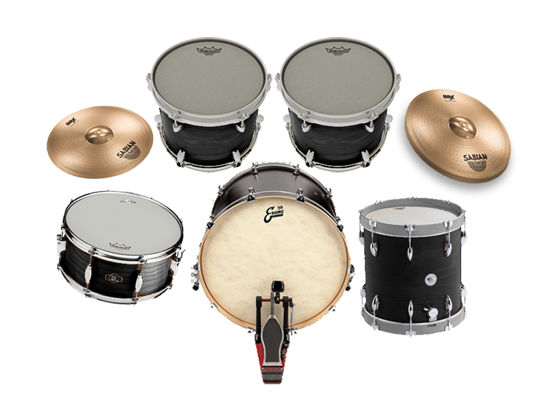

# Musical Instruments using Pyglet

**Musical instruments** is a project done by **Group F14**. This project involves playing music, where a player will be able to play musical instruments such as drum set, piano, tabala.

## Group Details

| Name                  | Roll No.  |
|-----------------------|-----------|
| G Bhavani Shankar     | 112201026 |
| M Kishore             | 112201035 |
| Aashutosh Kumar Ray   | 102201025 |

## Game Pics

.jpeg)

### Features

- **Experiencing Music** Enjoy various genres of music, from Piano, Drums, Tabala.
- **How amazing would it be to let your inner musician come to life**
  
### Installation

1. Clone the repository or download the game files.[Musical Instruments](https://github.com/GBhavaniShankar/Project_1)
2. Ensure you have python installed.
3. Install the necessary dependencies: pip install pyglet
4. Run the game: python main.py

### How to play

**In Drum set :**

- Z : Ride Cymbal
- X : Crash Cymbal
- C : Snare Drum
- V : High Tom
- B : Bass Drum
- N : Mid Tom
- M : Floor Tom

**In piano :**

- Z : First White Key
- X : Second White Key
- C : Third White Key
- V : Fourth White Key
- B : Fifth White Key
- N : Sixth White Key
- M : Seventh White Key
- S : First Black Key
- D : Second Black Key
- G : Third Black Key
- H : Fourth Black Key
- J : Fifth Black Key

 **In Drums :**

- A : Outer Part Hit In Tabala 1
- S : Middle Part Hit In Tabala 1
- D : Inner Part Hit In Tabala 1
- J : Outer Part Hit In Tabala 2
- K : Middle Part Hit In Tabala 2
- L : Inner Part Hit In Tabala 2

### Contributions

- G.BhavaniShankar(112201026)    : Loading page, Menu page, Drum set(image collection, key responces)
- M.Kishore(112201035) :Piano board creation and collection of sound
- AashutoshKumarRay(102201025):Tabala Creation

### Acknowledgements

- SFX were recorded in phones and then edited according to the instruments.
- We are grateful for the creative work and support of our team members and resources. Their contributions have greatly enhanced the quality and enjoyment of our Musical Instruments Game.

### Credits

- This game was developed by **IIT Palakkad Students** as a part of programming project

### License

- This project is licenced under **MIT Licence**

### Feedback and support

- For Feedback, Suggestions, or bug reports, Please create an issue here
